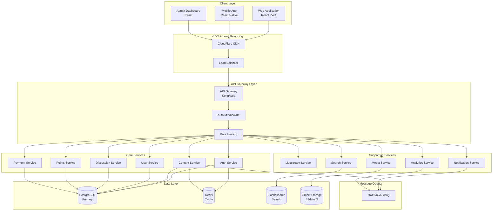
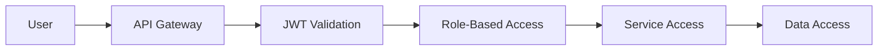
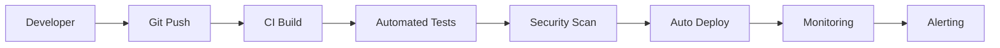

# System Architecture
## Great Nigeria Library Platform

**Document Version**: 1.0  
**Last Updated**: January 2025  
**Technical Owner**: Platform Engineering Team  

---

## Table of Contents

1. [Architecture Overview](#architecture-overview)
2. [System Principles](#system-principles)
3. [High-Level Architecture](#high-level-architecture)
4. [Microservices Architecture](#microservices-architecture)
5. [Data Architecture](#data-architecture)
6. [Security Architecture](#security-architecture)
7. [Deployment Architecture](#deployment-architecture)
8. [Scalability & Performance](#scalability--performance)
9. [Monitoring & Observability](#monitoring--observability)
10. [Integration Patterns](#integration-patterns)
11. [Technology Stack](#technology-stack)
12. [Migration Strategy](#migration-strategy)

---

## Architecture Overview

The Great Nigeria Library platform is built on a modern microservices architecture designed to serve millions of concurrent users across Africa and globally. The system prioritizes scalability, reliability, and performance while maintaining the flexibility to evolve with changing educational and technological landscapes.

### Core Design Principles

- **Microservices First**: Each service owns its domain and can scale independently
- **API Gateway Pattern**: Single entry point for all client requests
- **Database Per Service**: Each service maintains its own data store
- **Event-Driven Communication**: Asynchronous messaging for loose coupling
- **Cloud Native**: Designed for containerized deployment and auto-scaling
- **Security by Design**: Zero-trust security model throughout the stack

---

## System Principles

### 🎯 **Scalability**
- Horizontal scaling for all components
- Auto-scaling based on demand
- Regional distribution for global access
- Stateless service design

### 🔒 **Security**
- Zero-trust network architecture
- End-to-end encryption
- Multi-factor authentication
- Regular security audits

### 🚀 **Performance**
- Sub-second response times
- CDN for global content delivery
- Aggressive caching strategies
- Optimized database queries

### 🔧 **Reliability**
- 99.9% uptime target
- Circuit breaker patterns
- Graceful degradation
- Automated failover

### 📈 **Observability**
- Comprehensive logging
- Real-time monitoring
- Distributed tracing
- Business metrics tracking

---

## High-Level Architecture



---

## Microservices Architecture

### Core Business Services

#### 🔐 **Auth Service**
**Purpose**: User authentication, authorization, and session management

**Responsibilities**:
- User registration and login
- JWT token generation and validation
- Multi-factor authentication
- OAuth/SSO integration
- Role-based access control
- Session management

**Key APIs**:
```
POST /auth/register
POST /auth/login
POST /auth/refresh
POST /auth/logout
GET  /auth/profile
PUT  /auth/profile
POST /auth/reset-password
POST /auth/verify-email
```

**Database Schema**:
- users
- user_sessions
- user_roles
- oauth_tokens
- mfa_secrets

#### 📚 **Content Service**
**Purpose**: Educational content management and delivery

**Responsibilities**:
- Book and chapter management
- Content rendering and transformation
- Progress tracking
- Content access control
- Media file handling
- Search indexing

**Key APIs**:
```
GET  /books
GET  /books/{id}
GET  /books/{id}/chapters
GET  /books/{id}/chapters/{chapterId}
POST /books/{id}/progress
GET  /books/{id}/notes
POST /books/{id}/notes
```

**Database Schema**:
- books
- chapters
- sections
- user_progress
- user_notes
- content_metadata

#### 👥 **User Service**
**Purpose**: User profile and relationship management

**Responsibilities**:
- User profile management
- Friend/follow relationships
- User preferences
- Activity tracking
- Membership tiers
- Feature flags

**Key APIs**:
```
GET  /users/{id}
PUT  /users/{id}
GET  /users/{id}/friends
POST /users/{id}/friends
GET  /users/{id}/followers
POST /users/{id}/follow
```

#### 💬 **Discussion Service**
**Purpose**: Community discussions and forums

**Responsibilities**:
- Topic and thread management
- Comment moderation
- Voting and reactions
- Notification triggers
- Content reporting

**Key APIs**:
```
GET  /discussions
POST /discussions
GET  /discussions/{id}
POST /discussions/{id}/comments
PUT  /discussions/{id}/vote
```

#### 🏆 **Points Service**
**Purpose**: Gamification and achievement system

**Responsibilities**:
- Points calculation and assignment
- Badge and achievement management
- Leaderboards
- Milestone tracking
- Reward distribution

**Key APIs**:
```
GET  /points/balance
GET  /points/history
GET  /badges
GET  /leaderboard
POST /achievements/unlock
```

#### 💳 **Payment Service**
**Purpose**: Payment processing and subscription management

**Responsibilities**:
- Payment intent creation
- Subscription management
- Invoice generation
- Webhook handling
- Multi-provider support (Paystack, Flutterwave, Squad)

**Key APIs**:
```
POST /payments/intent
GET  /payments/history
POST /subscriptions
GET  /subscriptions
POST /webhooks/{provider}
```

### Supporting Services

#### 📺 **Livestream Service**
**Purpose**: Real-time streaming and virtual events

**Technologies**: WebRTC, RTMP, WebSocket
**Key Features**: Stream scheduling, chat integration, virtual gifts

#### 🔍 **Search Service**
**Purpose**: Content discovery and full-text search

**Technologies**: Elasticsearch, NLP processing
**Key Features**: Semantic search, faceted filtering, auto-complete

#### 📱 **Notification Service**
**Purpose**: Multi-channel notification delivery

**Technologies**: FCM, SMTP, WebSocket
**Key Features**: Push notifications, email, in-app messaging

#### 📊 **Analytics Service**
**Purpose**: Business intelligence and user behavior tracking

**Technologies**: Time-series database, data pipelines
**Key Features**: Real-time analytics, custom reports, A/B testing

#### 🎬 **Media Service**
**Purpose**: Digital asset management and transformation

**Technologies**: FFmpeg, ImageMagick, CDN integration
**Key Features**: Image/video processing, thumbnail generation, adaptive streaming

---

## Data Architecture

### Primary Database Strategy

#### **PostgreSQL Cluster Configuration**
- **Master-Slave Replication**: High availability with automatic failover
- **Read Replicas**: Distributed across regions for read scaling
- **Connection Pooling**: PgBouncer for efficient connection management
- **Backup Strategy**: Continuous WAL archiving with point-in-time recovery

#### **Database Per Service Pattern**
Each microservice maintains its own database schema:

```
auth_db          → Auth Service
content_db       → Content Service
user_db          → User Service
discussion_db    → Discussion Service
points_db        → Points Service
payment_db       → Payment Service
livestream_db    → Livestream Service
analytics_db     → Analytics Service
```

### Caching Strategy

#### **Redis Cluster**
- **Session Store**: User sessions and authentication tokens
- **Application Cache**: Frequently accessed data
- **Rate Limiting**: Request throttling and API quotas
- **Pub/Sub**: Real-time messaging and notifications

#### **CDN Caching**
- **Static Assets**: Images, videos, documents
- **API Responses**: Cacheable API endpoints
- **Edge Computing**: Region-specific processing

### Search & Analytics

#### **Elasticsearch Cluster**
- **Content Indexing**: Full-text search across all content
- **Log Aggregation**: Centralized logging and analysis
- **Real-time Analytics**: User behavior and platform metrics

#### **Time-Series Database**
- **Metrics Storage**: Performance and business metrics
- **Event Tracking**: User interactions and system events
- **Alerting**: Automated monitoring and alerting

### File Storage

#### **Object Storage (S3/MinIO)**
- **Content Assets**: Books, images, videos, documents
- **User Uploads**: Profile pictures, assignments, projects
- **Backup Storage**: Database backups and archives
- **CDN Integration**: Global content distribution

---

## Security Architecture

### Zero-Trust Security Model

#### **Authentication & Authorization**


#### **Security Layers**

1. **Network Security**
   - VPC with private subnets
   - Security groups and NACLs
   - WAF (Web Application Firewall)
   - DDoS protection

2. **Application Security**
   - JWT token-based authentication
   - Role-based access control (RBAC)
   - API rate limiting
   - Input validation and sanitization

3. **Data Security**
   - Encryption at rest (AES-256)
   - Encryption in transit (TLS 1.3)
   - Database encryption
   - PII data anonymization

4. **Infrastructure Security**
   - Container image scanning
   - Secrets management (Vault/K8s secrets)
   - Security monitoring and alerting
   - Regular security audits

### Compliance & Privacy

#### **Data Protection**
- **GDPR Compliance**: Right to deletion, data portability
- **NDPR Compliance**: Nigerian data protection regulations
- **Data Minimization**: Collect only necessary data
- **Consent Management**: Granular privacy controls

#### **Security Monitoring**
- **SIEM Integration**: Security incident and event management
- **Vulnerability Scanning**: Automated security assessments
- **Penetration Testing**: Regular security testing
- **Incident Response**: Documented security procedures

---

## Deployment Architecture

### Container Orchestration (Kubernetes)

#### **Cluster Configuration**
```yaml
# Production Kubernetes Cluster
apiVersion: v1
kind: Namespace
metadata:
  name: greatnigeria-prod

---
# Example Service Deployment
apiVersion: apps/v1
kind: Deployment
metadata:
  name: auth-service
  namespace: greatnigeria-prod
spec:
  replicas: 3
  selector:
    matchLabels:
      app: auth-service
  template:
    metadata:
      labels:
        app: auth-service
    spec:
      containers:
      - name: auth-service
        image: greatnigeria/auth-service:v1.0.0
        ports:
        - containerPort: 8080
        env:
        - name: DATABASE_URL
          valueFrom:
            secretKeyRef:
              name: auth-db-secret
              key: connection-string
```

#### **Service Mesh (Istio)**
- **Traffic Management**: Load balancing, retries, timeouts
- **Security**: mTLS, authentication, authorization
- **Observability**: Metrics, logs, distributed tracing
- **Policy Enforcement**: Rate limiting, circuit breaking

### Multi-Region Deployment

#### **Primary Regions**
1. **West Africa** (Lagos, Nigeria)
   - Primary deployment region
   - Low latency for Nigerian users
   - Local data compliance

2. **Europe** (Frankfurt, Germany)
   - European and diaspora users
   - GDPR compliance region
   - Secondary backup region

3. **North America** (Virginia, USA)
   - North American diaspora
   - Global CDN edge location
   - Research partnerships

#### **Disaster Recovery**
- **RTO Target**: 15 minutes
- **RPO Target**: 5 minutes
- **Automated Failover**: Health check based
- **Data Replication**: Cross-region database replication

### CI/CD Pipeline

#### **GitOps Workflow**


#### **Deployment Stages**
1. **Development**: Feature branch deployment
2. **Staging**: Integration testing environment
3. **Pre-Production**: Load testing and validation
4. **Production**: Blue-green deployment strategy

---

## Scalability & Performance

### Horizontal Scaling Strategies

#### **Auto-Scaling Configuration**
```yaml
# Horizontal Pod Autoscaler
apiVersion: autoscaling/v2
kind: HorizontalPodAutoscaler
metadata:
  name: auth-service-hpa
spec:
  scaleTargetRef:
    apiVersion: apps/v1
    kind: Deployment
    name: auth-service
  minReplicas: 3
  maxReplicas: 50
  metrics:
  - type: Resource
    resource:
      name: cpu
      target:
        type: Utilization
        averageUtilization: 70
  - type: Resource
    resource:
      name: memory
      target:
        type: Utilization
        averageUtilization: 80
```

#### **Database Scaling**
- **Read Replicas**: Horizontal read scaling
- **Sharding Strategy**: User-based partitioning
- **Connection Pooling**: Efficient resource utilization
- **Query Optimization**: Index tuning and caching

### Performance Optimization

#### **Caching Strategy**
1. **L1 Cache**: Application-level caching
2. **L2 Cache**: Redis distributed cache
3. **L3 Cache**: CDN edge caching
4. **Browser Cache**: Client-side caching

#### **Performance Targets**
- **API Response Time**: < 200ms (95th percentile)
- **Page Load Time**: < 2 seconds
- **Database Query Time**: < 50ms (95th percentile)
- **Cache Hit Ratio**: > 85%

---

## Monitoring & Observability

### Observability Stack

#### **Metrics Collection (Prometheus)**
```yaml
# Example metrics collection
- name: http_requests_total
  type: counter
  description: Total HTTP requests
  labels: [method, status, endpoint]

- name: response_time_seconds
  type: histogram
  description: HTTP response time
  buckets: [0.1, 0.25, 0.5, 1, 2.5, 5, 10]

- name: active_users
  type: gauge
  description: Currently active users
```

#### **Distributed Tracing (Jaeger)**
- **Request Flow**: End-to-end request tracing
- **Performance Analysis**: Bottleneck identification
- **Error Attribution**: Root cause analysis
- **Service Dependencies**: Service interaction mapping

#### **Centralized Logging (ELK Stack)**
- **Log Aggregation**: Elasticsearch, Logstash, Kibana
- **Structured Logging**: JSON-formatted logs
- **Log Retention**: 90-day retention policy
- **Alert Integration**: Log-based alerting

### Health Monitoring

#### **Health Check Endpoints**
```go
// Example health check implementation
func HealthCheck(c *gin.Context) {
    health := map[string]interface{}{
        "status": "healthy",
        "timestamp": time.Now().UTC(),
        "version": os.Getenv("APP_VERSION"),
        "dependencies": map[string]string{
            "database": checkDatabase(),
            "redis": checkRedis(),
            "external_api": checkExternalAPI(),
        },
    }
    
    c.JSON(200, health)
}
```

#### **Alerting Strategy**
- **Critical Alerts**: Immediate notification (5 minutes)
- **Warning Alerts**: Delayed notification (15 minutes)
- **Information Alerts**: Daily summary reports
- **Escalation Policy**: Tiered response team

---

## Integration Patterns

### Synchronous Communication

#### **REST API Standards**
```yaml
# OpenAPI 3.0 specification
openapi: 3.0.0
info:
  title: Great Nigeria Library API
  version: 1.0.0
paths:
  /api/v1/books:
    get:
      summary: List books
      parameters:
        - name: page
          in: query
          schema:
            type: integer
            default: 1
        - name: limit
          in: query
          schema:
            type: integer
            default: 20
      responses:
        '200':
          description: Successful response
          content:
            application/json:
              schema:
                type: object
                properties:
                  data:
                    type: array
                    items:
                      $ref: '#/components/schemas/Book'
                  pagination:
                    $ref: '#/components/schemas/Pagination'
```

#### **gRPC Internal Communication**
```protobuf
// Internal service communication
syntax = "proto3";

service UserService {
  rpc GetUser(GetUserRequest) returns (User);
  rpc UpdateUser(UpdateUserRequest) returns (User);
  rpc ValidatePermission(PermissionRequest) returns (PermissionResponse);
}

message User {
  string id = 1;
  string email = 2;
  string name = 3;
  repeated string roles = 4;
  google.protobuf.Timestamp created_at = 5;
}
```

### Asynchronous Communication

#### **Event-Driven Architecture**
```go
// Example event structure
type Event struct {
    ID        string                 `json:"id"`
    Type      string                 `json:"type"`
    Source    string                 `json:"source"`
    Data      map[string]interface{} `json:"data"`
    Timestamp time.Time              `json:"timestamp"`
    Version   string                 `json:"version"`
}

// Event types
const (
    UserRegistered    = "user.registered"
    BookCompleted     = "book.completed"
    PaymentProcessed  = "payment.processed"
    StreamStarted     = "stream.started"
)
```

#### **Message Queue Patterns**
- **Publish-Subscribe**: Event broadcasting
- **Request-Reply**: Synchronous-like async communication
- **Message Routing**: Content-based routing
- **Dead Letter Queue**: Failed message handling

---

## Technology Stack

### Backend Technologies

#### **Core Stack**
- **Language**: Go 1.21+
- **Framework**: Gin (HTTP), gRPC (Internal)
- **Database**: PostgreSQL 15+
- **Cache**: Redis 7+
- **Message Queue**: NATS/RabbitMQ
- **Search**: Elasticsearch 8+

#### **Infrastructure**
- **Containerization**: Docker, Kubernetes
- **Service Mesh**: Istio
- **API Gateway**: Kong/Istio Gateway
- **Monitoring**: Prometheus, Grafana, Jaeger
- **CI/CD**: GitLab CI/CD, ArgoCD

### Frontend Technologies

#### **Web Application**
- **Framework**: React 18+ with TypeScript
- **State Management**: Redux Toolkit
- **Routing**: React Router
- **UI Library**: Material-UI / Custom Design System
- **Build Tool**: Vite
- **Testing**: Jest, React Testing Library

#### **Mobile Application**
- **Framework**: React Native
- **State Management**: Redux Toolkit
- **Navigation**: React Navigation
- **Native Modules**: Expo SDK
- **Offline Support**: React Query with cache

### Development Tools

#### **Code Quality**
- **Linting**: ESLint (JS/TS), golangci-lint (Go)
- **Formatting**: Prettier (JS/TS), gofmt (Go)
- **Testing**: Jest, Go testing package
- **Security**: Snyk, OWASP ZAP
- **Documentation**: Swagger/OpenAPI

---

## Migration Strategy

### Current State Analysis

#### **Identified Issues**
1. **Missing `pkg/` Directory**: Shared utilities not implemented
2. **Mock API Gateway**: Returns static data instead of proxying
3. **Service Dependencies**: Circular dependencies and tight coupling
4. **Documentation Fragmentation**: Multiple conflicting architecture docs

### Migration Phases

#### **Phase 1: Foundation (Months 1-3)**
1. **Create `pkg/` Directory Structure**
   ```
   pkg/
   ├── common/
   │   ├── config/
   │   ├── database/
   │   ├── logger/
   │   ├── middleware/
   │   └── utils/
   ├── auth/
   │   ├── jwt/
   │   └── rbac/
   └── errors/
       └── types.go
   ```

2. **Implement Shared Components**
   - Database connection management
   - Logging and monitoring
   - Authentication middleware
   - Error handling patterns

3. **Fix Service Compilation Issues**
   - Update import paths
   - Resolve dependency conflicts
   - Standardize configuration

#### **Phase 2: Service Integration (Months 4-6)**
1. **Replace Mock API Gateway**
   - Implement real service proxying
   - Add authentication middleware
   - Implement rate limiting

2. **Service Communication**
   - Implement gRPC internal APIs
   - Add circuit breakers
   - Implement retry logic

3. **Database Separation**
   - Create service-specific databases
   - Implement data migration
   - Add replication setup

#### **Phase 3: Production Readiness (Months 7-9)**
1. **Scalability Implementation**
   - Kubernetes deployment
   - Auto-scaling configuration
   - Load testing validation

2. **Security Hardening**
   - Implement zero-trust security
   - Add comprehensive monitoring
   - Security audit and penetration testing

3. **Performance Optimization**
   - CDN integration
   - Caching implementation
   - Database optimization

#### **Phase 4: Advanced Features (Months 10-12)**
1. **Multi-Region Deployment**
   - Disaster recovery setup
   - Cross-region replication
   - Global load balancing

2. **Advanced Monitoring**
   - Business metrics dashboard
   - Automated alerting
   - Capacity planning

3. **Feature Completion**
   - Complete remaining features
   - User acceptance testing
   - Production launch

### Success Criteria

#### **Technical Metrics**
- All services compile and run successfully
- API Gateway proxies to real services
- Database separation completed
- 99.9% uptime achieved
- Sub-200ms API response times

#### **Business Metrics**
- 10,000+ active users
- 100+ content creators
- 1,000+ pieces of content
- Sustainable operational costs
- Positive user feedback

---

*This architecture document serves as the single source of truth for the Great Nigeria Library platform's technical design and implementation strategy.* 